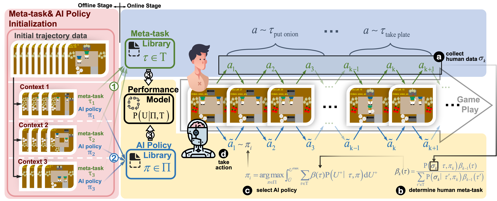

# 🥘 CBPR 
Official code for NeurIPS 2024 paper: [Beyond Single Stationary Policies: Meta-Task Players as Naturally Superior Collaborators](https://openreview.net/pdf?id=HpN4xeDJQF). 

# Installation
```
conda create -n cbpr python=3.8
conda activate cbpr
pip install -r requirements.txt
```
# Training
Training of baseline algorithms and MTP agents. Note that ALL agents are implemented based on PPO.
## Self-play (SP)
Train SP agent in _Cramped Room_ layout:
```
cd algorithms/baselines
sh train_sp.sh
```
## FCP
FCP algorithm was firstly introduced in [Collaborating with Humans without Human Data](https://arxiv.org/abs/2110.08176). Train FCP agent in _Cramped Room_ layout:
```
cd algorithms/baselines
sh train_fcp.sh
```
## BCP
BCP agent was firstly introduced in [On the Utility of Learning about Humans for Human-AI Coordination](https://arxiv.org/abs/1910.05789). To train BCP agent, please firstly train behavioral cloning model using `./algorithms/bc/bc.sh`. Next, train BCP agent using:
 ```
 cd algorithms/baselines
 sh train_bcp.sh
 ```
## MTP
To train MTP agents by pairing them with rule-based agents, run:
 ```
 cd algorithms
 sh mtp_scriptedPolicy.sh
 ```

# Evaluation
## Collaborating with agents that switch policies
Pair BCP agent with agent that switches policies every 100 timesteps in _Cramped Room_ layout. 
```
python experiments/exp1/evaluate_scriptPolicy.py --layout cramped_room --num_episodes 50 --mode intra --switch_human_freq 100 --seed 1 --algorithm BCP
```
Pair FCP agent with agent that switches policies every 2 episodes in _Cramped Room_ layout. 
```
python experiments/exp1/evaluate_scriptPolicy.py --layout cramped_room --num_episodes 50 --mode inter --switch_human_freq 2 --seed 1 --algorithm FCP
```
Pair CBPR with agent that switches policies every 200 timesteps in _Cramped Room_ layout. 
```
python experiments/exp1/okr_scriptedPolicy.py --layout cramped_room --num_episodes 50 --mode intra --switch_human_freq 200 --seed 1 --Q_len 20 --rho 0.9
```
## Collaborating with agents using various skill levels
Pair BCP agent with agent using _high_ skill level in _Cramped Room_ layouts.
```
python experiments/exp2/evaluate_skill_levels.py --layout cramped_room --num_episodes 50 --skill_level high --algorithm BCP --use_wandb
```
Pair FCP agent with agent using _low_ skill level in _Cramped Room_ layouts.
```
python experiments/exp2/evaluate_skill_levels.py --layout cramped_room --num_episodes 50 --skill_level low --algorithm FCP --use_wandb
```
Pair CBPR with agent using _medium_ skill level in _Cramped Room_ layouts.
```
python experiments/exp2/okr_skill_levels.py --layout cramped_room --num_episodes 50 --skill_level medium --Q_len 20 --rho 0.9 --use_wandb
```
## To evaluate human-AI performance
``` 
python src/overcooked_demo/server/app.py
```
The *Overcooked* game interface can be accessed at 127.0.0.1:5001.

# Acknowledgement
Our code is built upon some prior works.

* The settings of *Overcooked* environment are  adapted from https://github.com/HumanCompatibleAI/overcooked_ai.
* The implementation of FCP agent and rule-based policies are apapted from https://github.com/samjia2000/HSP.


# Publication
```
@inproceedings{wangbeyond,
  title={Beyond Single Stationary Policies: Meta-Task Players as Naturally Superior Collaborators},
  author={Wang, Haoming and Tian, Zhaoming and Song, Yunpeng and Zhang, Xiangliang and Cai, Zhongmin},
  booktitle={The Thirty-eighth Annual Conference on Neural Information Processing Systems}
}
```
